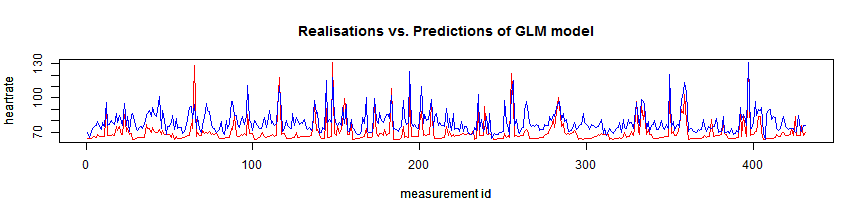

## Fitbit measures your activity, this apps provides deeper insights about your heart rate

* The Fitbit Charge Hr monitors the heart rate automatically and continuously. 
* It also measures steps, distance, calories burned, stairs climbed and active minutes. 
* The fitbit website provides stats and figures about these activities. 

<strong>
This applicition provides the ability to investigate the activities in relation to the heart rate even further.
</strong>

1. Which activities influence the heart rate? And by how much?

2. Which explanatory variabels should be taken into account when predicting the heart rate?

3. Which model predicts the heart rate the best? 

4. What is the predicted heart at a given set of values for eacht of the variables?

--- .class #id 

## Which variables influence your heartrate 

The Exploratory graphs tab of the  "Fitbit heart rate analyses app" provides insights in which variables influence your heart rate. Variables taken into account are:
* Steps
* Floors
* Distance
* Active minutes in an hour
* Day of the week
* Hour of the day

In the graph below an example is shown. It displays the relationship between Hour of the day and heart rate.

--- .class #id 

## Model your heart rate with different models and variables (1/2)

The Heart rate prediction tab challenges the user to find the best model to predict the heart rate. You can select two different models (knn and glm), 5 different variables (Distance, Floors , Calories burned, Step count, Active Minutes , Day of the week, Hour), and predict the heart rate for selected values of the selected variables.
The graph below shows the realized and predicted heart rate for the models on the testing set, which contains of 25% of the total dataset. 

The Out of sample R-squared of the GLM model:0.53 and the KNN model: 0.56

--- .class #id 

## Find out which model performs best and estimate your own heart rate
 
This app helps you find the model that best estimates the heart rate. 
It gives the user the ability to play with the models and variables. 
This will give the user insights in the relationship between heart rate and their activities.

### Points for improvement:

* Add graphs with realization and predictions to application

* Give the user the ability to select the size of the test and train set

* Provide insights regarding variable importance

* Add model explanation

* Add more model options and methods

* And 100+ more improvements:)

